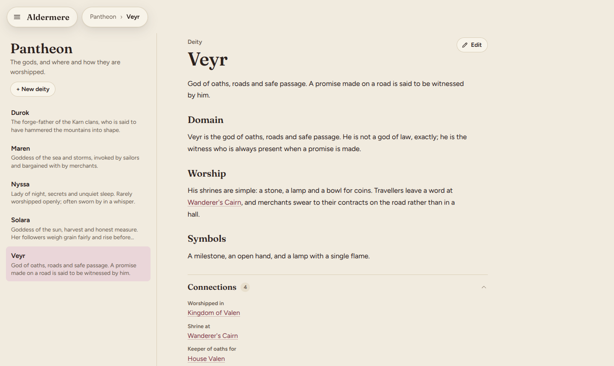
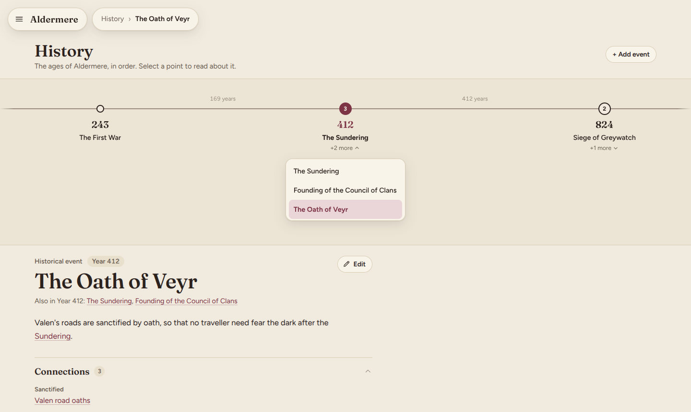
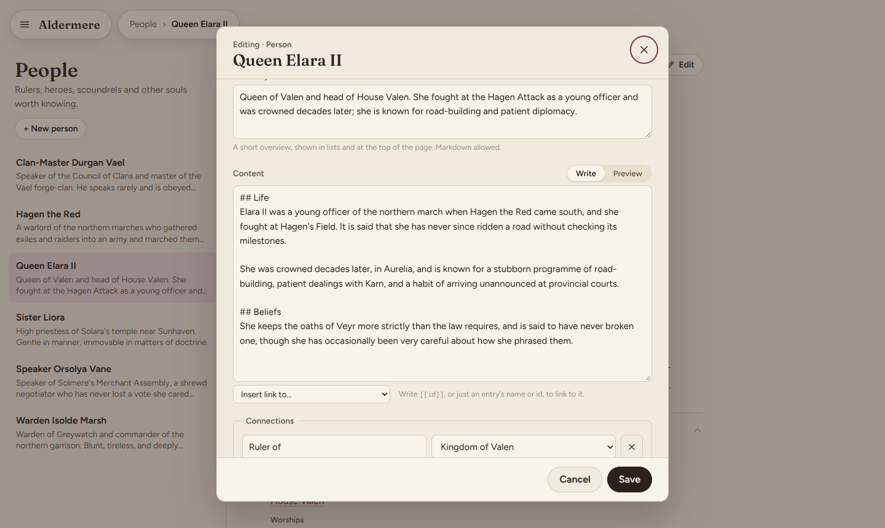

# Atlas

A map-first interactive atlas and encyclopedia for a tabletop RPG world. Open the site, see the world, click a
country and the map glides in, click a region and it glides in again, then click a city to read about it. A
hamburger menu also leads to an encyclopedia (People, Factions, Organizations, Pantheon, Politics, Culture) and a
History timeline, all cross-linked with the map.

Everything you add — a country, a person, a historical event, an image — is built **from the website itself** while
it's running on your own computer. There's no separate content editor or database: the site writes plain files for
you, and those files are the whole world.

| World | Country | Encyclopedia entry |
| :---: | :---: | :---: |
|  |  |  |
| **City** | **History** | **Editing** |
|  |  |  |

---

## Contents

- [Getting started](#getting-started)
- [Exploring the site](#exploring-the-site)
- [Adding and editing places](#adding-and-editing-places)
- [Adding people, factions, and everything else](#adding-people-factions-and-everything-else)
- [Writing content: summaries, articles, links and images](#writing-content-summaries-articles-links-and-images)
- [Location icons](#location-icons)
- [Setting up your own world](#setting-up-your-own-world)
- [Tracing your own map](#tracing-your-own-map)
- [URLs](#urls)
- [Deploying to GitHub Pages](#deploying-to-github-pages)
- [Troubleshooting](#troubleshooting)
- [Tech stack](#tech-stack)
- [Roadmap](#roadmap)

---

## Getting started

You need [Node.js](https://nodejs.org) **20.19 or newer** (22 recommended).

```bash
npm install        # install dependencies (once)
npm run dev        # start the site, then open the printed address (http://localhost:5173)
```

| Command | What it does |
| --- | --- |
| `npm run dev` | Runs the site on your computer, **with the editing tools turned on** |
| `npm run build` | Type-checks, then builds the production site into `dist/` (no editing tools) |
| `npm run preview` | Serves the built `dist/` locally, to check what you'd deploy |
| `npm test` | Runs the unit tests (including a check that your world data is valid) |
| `npm run typecheck` | TypeScript check only |

**The editing tools — the "Edit" and "+ New" buttons, and the Trace map-drawing tool — only appear while `npm run dev`
is running on your machine.** A deployed site (GitHub Pages, or anything built with `npm run build`) is read-only:
visitors browse it, but adding or changing content happens locally, and you deploy the result. See
[Deploying to GitHub Pages](#deploying-to-github-pages).

---

## Exploring the site

- Open the hamburger menu (top left) to jump between **Atlas**, **People**, **Factions**, **Organizations**,
  **Pantheon**, **Politics**, **Culture** and **History**.
- **On the map:** click a country, then a region, then a city marker. The camera flies there and the side panel
  updates. **Scroll** to zoom (anchored to the cursor), **drag** to pan, or use the **+ / − / recenter** buttons.
  **Breadcrumbs** at the top jump back up, **Esc** steps up one level, and the panel's **‹ back** button does the
  same. Everything in the side panel is clickable, including the "In *Central Plains*, *Kingdom of Valen*" links.
- **In the encyclopedia and History:** pick a section from the menu to see its list of entries; click one to read it.
  Every entry has a short **Overview** at the top and a longer article beneath it. Names mentioned in the text that
  match another entry become links automatically — you never have to add those by hand.
- Hover anything on the map for a tooltip. Click the **›** in the panel header to hide it; click the tab to bring it
  back.

---

## Adding and editing places

Places (countries, regions, cities, points of interest, islands) live on the map, so they're built with the **Trace**
tool, then filled in with the **Edit** dialog. Both only appear while `npm run dev` is running.

### Drawing a shape

1. On the map, click **Trace** (top right). A panel opens on the side of the map.
2. Pick what you're drawing: **Country**, **Region**, **City**, **Point of interest**, or **Island**.
   - Countries, regions and islands are **shapes**: click around its edge on the map, one click per corner. The
     outline closes itself once you have at least three points. Corners of shapes already on the map are snapped to,
     so neighbouring borders match exactly (hold **Alt** to turn snapping off).
   - A country or island made of several separate pieces (an archipelago, an exclave): finish the first outline,
     press **Add Island**, and trace the next piece. Repeat as needed.
   - Cities and points of interest are **markers**: click once where it goes. Click again to move it before saving.
3. Fill in **Name**, **Inside** (which country/region/city/island it belongs to — only valid options are offered),
   an **Icon** for markers, and check the **File name (id)**, which the site fills in from the name and which becomes
   part of this place's web address.
4. Press **Save**. The shape appears on the map immediately.

**Undo** removes the last point, **Clear** starts the current outline over, and **Backspace** also undoes a point.

### Changing a shape's outline

Select the place on the map, open **Trace**, and press **Redraw "<name>"**. Trace this shape again the same way; its
name, description, images and connections are untouched — only the outline changes. Redraw for a country that has
islands also needs the islands re-added with **Add Island**, or their territory will look stale against the new
outline.

### Full walkthrough

**[docs/TRACING.md](docs/TRACING.md)** goes step by step, starting from a map you've drawn in Paint (or anything
else) and ending with a clickable world — see [Tracing your own map](#tracing-your-own-map) below for the short
version.

---

## Adding people, factions, and everything else

People, factions, organizations, deities, politics and culture entries, and historical events, aren't drawn on a map
— they're added straight from their section:

1. Open the section from the hamburger menu (**People**, **Factions**, **History**, and so on).
2. Press **+ New person** (or **+ New faction**, **+ Add event**, …) at the top of the list.
3. Fill in the [Edit dialog](#writing-content-summaries-articles-links-and-images) — the same one used for places —
   and press **Create**.

A place you've already traced can be opened the same way: select it and press **Edit** to fill in everything below.

---

## Writing content: summaries, articles, links and images

The Edit dialog (opened with **Edit** on an existing entry, or **+ New …**/**Add event**) is the same for every kind
of entry:

| Field | Notes |
| --- | --- |
| **Name** | Shown everywhere this entry appears. |
| **File name (id)** *(new entries only)* | Filled in from the name; part of this entry's web address. Can't be changed later. |
| **Year** / **Order in year** *(events only)* | A whole number; several events can share a year, and "Order in year" controls which is listed first among them. |
| **Map icon** *(cities and points of interest only)* | See [Location icons](#location-icons). |
| **Map colour** *(countries, regions and islands only)* | Any colour; if you leave it, one is chosen from a built-in palette. To change a shape's outline instead, use Trace → Redraw. |
| **Image** | Optional. **Choose image…** to upload one (PNG, JPEG, WebP or GIF, up to 6 MB) with an instant preview; **Replace** or **Remove** it later. Shown prominently at the top of the entry's page. |
| **Summary** | A short overview shown in lists and as the "Overview" at the top of the page. Markdown allowed. |
| **Content** | The full article, in Markdown, below the Overview. Switch between **Write** and **Preview** to see exactly how it will render. **Insert link to…** drops in a link to another entry without typing its id. |
| **Connections** | Labelled links to other entries, e.g. "Ruler of → Kingdom of Valen". Press **+ Add connection**, type a label, and choose the target entry. |

A few notes worth knowing:

- **You don't have to link things by hand.** If your text mentions another entry's name or id, it's turned into a
  link automatically, the first time it's mentioned. Use `[[id]]` or `[[id|shown as this]]` for an explicit link, or
  when the automatic matching doesn't pick the entry you mean.
- Closing the dialog with unsaved changes asks you to confirm first, whether you click **Cancel**, the **×**,
  outside the dialog, or press **Esc**.
- Saving reloads the page so everything (including newly linked entries) is up to date; a newly created entry opens
  automatically.

---

## Location icons

Pick one from the **Icon** field in Trace, or the **Map icon** field in the Edit dialog, on a city or point of
interest:

| Icon | Looks like | Suggested for |
| --- | --- | --- |
| Capital | star (drawn in the accent colour) | Capitals |
| City | skyline | Large cities |
| Town | house | Towns |
| Village | small dot | Villages, hamlets |
| Castle | crenellated wall | Castles, fortresses |
| Temple | columned temple | Temples, shrines |
| Ruins | broken columns | Ruins |
| Battlefield | crossed swords | Battlefields |
| Dungeon | keyhole | Dungeons, caves |
| Point of interest | diamond | Anything else |

Leaving it as **Default** picks a sensible icon for the kind of place (a skyline for cities, a diamond otherwise).

---

## Setting up your own world

Most of a world is built entirely from the website (above). One file is still edited by hand: `src/data/world.json`,
which holds the world's name, tagline, and the map's coordinate space.

1. **Rename your world.** Edit `src/data/world.json`: change `id`, `name`, `tagline`. If you're tracing your own map,
   also set `map.width`/`height` and the reference image — see [Tracing your own map](#tracing-your-own-map).
2. **Clear out the demo world.** Delete the files under `src/data/locations/`, `src/data/entities/` and
   `src/data/history/`, and the Markdown files under `src/content/`. While there's nothing there, the app shows an
   empty map, which is expected.
3. **Delete `src/lib/content/demoWorld.test.ts`.** It checks facts about the bundled demo world specifically and
   will fail once that world is gone. `worldData.test.ts` keeps checking that whatever you replace it with is valid.
4. **Add your countries first, then everything else**, using Trace and the Edit dialog — each place needs its parent
   to already exist. Check the browser after each one.
5. **Commit.** Your world is now just files in Git, with a history of every change.

---

## Tracing your own map

If you've drawn a map in Paint (or anything else), you can trace it:

1. Copy the image into `public/reference/`, for example `public/reference/my-map.png`.
2. Open the image's properties and note its size in pixels, say 1600 × 1000.
3. In `src/data/world.json`, set the map size **to the image's pixel size** and point at the image:

   ```json
   "map": {
     "width": 1600,
     "height": 1000,
     "referenceImage": { "src": "reference/my-map.png", "opacity": 0.5 }
   }
   ```

4. Reload. Your image now floats above the map at half opacity, and a small **image button** appears in the map
   controls to show or hide it.
5. Trace each shape with the Trace tool, right over the image: because the map size matches the image's pixels,
   what you click lines up with what Paint's status bar would show at the same spot.
6. When you're done, delete the `referenceImage` block from `world.json`. It's only a tracing guide; the interactive
   map is the shapes you've drawn.

**Full walkthrough:** [docs/TRACING.md](docs/TRACING.md).

---

## URLs

Every place and every entry has a direct link, and the browser's back button works:

```
/atlas                                                     the world map
/atlas/kingdom-of-valen                                    a country
/atlas/kingdom-of-valen/central-plains                     a region
/atlas/kingdom-of-valen/central-plains/aurelia             a city
/people/queen-elara-ii                                     an encyclopedia entry
/history/founding-of-valen                                 a historical event
```

Because ids are unique across the whole world, **short links work too**: `/atlas/aurelia` redirects to the full path
above, and this holds for every kind of entry.

## Deploying to GitHub Pages

The repository includes `.github/workflows/deploy.yml`. To use it: push to GitHub, then in the repository go to
**Settings → Pages → Source: GitHub Actions**. Every push to `main` runs the tests, builds the site with the right
sub-path, and publishes it.

To deploy by hand, build with your repository name as the base path:

```bash
VITE_BASE=/my-repo-name/ npm run build     # Windows PowerShell: $env:VITE_BASE="/my-repo-name/"; npm run build
```

The build also writes `dist/404.html` (a copy of the app), which lets GitHub Pages serve direct links like
`/atlas/kingdom-of-valen` even though it has no server-side routing.

**Remember:** the deployed site has no Edit or Trace buttons — do your writing and drawing with `npm run dev` running
locally, commit the files it writes, then deploy.

---

## Troubleshooting

**A place, person or event doesn't show up.**
Regions and islands only appear once their *country* is selected; markers (cities, points of interest) only appear
once their region or island is selected (or the marker itself is). If it's still missing, open it directly by its id
under the relevant section, or check for a data-warning banner (below).

**The page turns into "Your world data needs a fix," with a list of problems.**
That's the validator; it replaces the app until every error is fixed. Each message names the file and the problem,
for example *"has parent 'centrl-plains', but no location with that id exists."* If you built the entry with the
website, this almost never happens; if you hand-edit a file, fix it and save — the page reloads itself.

**A small "data warnings" note appears in the corner (dev only).**
The data loads but something looks off, most often a marker whose coordinates fall outside its parent's outline. The
message names the file and place; it isn't fatal, but worth a look.

**I can't see the Edit or Trace buttons.**
They only exist while `npm run dev` is running, not in a built or deployed site.

**Closing the Edit dialog asks me to confirm.**
That's expected once you've changed something — it's confirming you want to discard the change, not a bug.

**A label is in an awkward place, or overlaps a marker.**
Labels default to the middle of a shape. Select it, **Trace → Redraw**, and if it's still awkward add
`"labelPosition": { "x": 300, "y": 220 }` to its JSON file by hand.

**Colours look flat or wrong in an older browser.**
Region shading uses CSS `color-mix()`, supported by browsers from 2023 onward. Update your browser, or set an
explicit colour on the region in the Edit dialog.

### If you're editing files by hand

The website covers everything day to day, but every file it writes is a plain, readable JSON or Markdown file, and
nothing stops you from opening one directly — see [Tech stack](#tech-stack) for where they live.

**A red Vite error overlay mentions "JSON" or "Unexpected token".**
The file isn't valid JSON: usually a missing comma between fields, a trailing comma after the last field, or single
quotes instead of double quotes. Paste it into a JSON validator, or open it in VS Code, which underlines the mistake.

**My traced outlines don't line up with my reference image.**
`map.width` and `map.height` in `world.json` must equal the image's pixel size exactly.

**The reference image doesn't appear.**
`referenceImage.src` is relative to `public/`, so `"reference/my-map.png"` means the file
`public/reference/my-map.png`. No leading slash, and check the spelling and case. Restart `npm run dev` if you just
added the file.

**`npm install` or `npm run dev` fails.**
Check `node -v` is 20.19 or newer. If the port is busy, Vite picks the next free one and prints it.

---

## Tech stack

- **React + TypeScript**, built with **Vite**. `npm run build` type-checks the whole project before producing a
  static `dist/` folder — there's no backend and no database in the deployed site.
- **Your world is plain files, not a database:**

  ```
  src/data/world.json            world name, tagline, and the map's coordinate space
  src/data/locations/**.json     places: countries, regions, cities, points of interest, islands
  src/data/entities/**.json      lore: people, factions, organizations, deities, politics, culture
  src/data/history/**.json       historical events
  src/content/**/<id>.md         each entry's long-form article, one Markdown file per id
  public/images/<id>.<ext>       each entry's optional image
  ```

  Every file above can be opened, read and edited directly — they're what the website reads and writes for you.
  Whatever you do through Edit or Trace ends up as an ordinary change to one of these files, so `git diff` after a
  save shows exactly what changed, and the whole world's history is just your Git history.
- **The editing tools are dev-only.** `tools/atlasDevSave.ts` is a local Vite plugin that lets Edit and Trace save
  files while `npm run dev` is running; it's compiled out of `npm run build` entirely, so a deployed site can't
  write anything.
- **The full technical rationale — the data model, the map's camera and level-of-detail rules, how links resolve,
  and how the editing tools work — is in [docs/ARCHITECTURE.md](docs/ARCHITECTURE.md).**

---

## Roadmap

| Phase | Scope | Status |
| --- | --- | --- |
| 1 | Working atlas: map, zoom/pan, side panel, breadcrumbs, countries with regions/islands with cities and points of interest, icons, tooltips, routing, validation | **Done** |
| 2 | Content system: Markdown lore per entry, an Overview separate from the article, cross-references between entries, optional images | **Done.** Global search is still planned |
| 3 | Encyclopedia: People, Factions, Organizations, Pantheon, Politics, Culture, History timeline | **Done** |
| 4 | In-browser editor: click-to-trace, snapping, save and redraw, the Edit dialog for every kind of entry (dev only) | **Mostly done.** Still to come: dragging individual corners of a shape, and deleting an entry from the website (for now, delete its file) |
| 5 | Polish: animation, typography, empty/loading states, responsive and accessibility passes | Ongoing |
