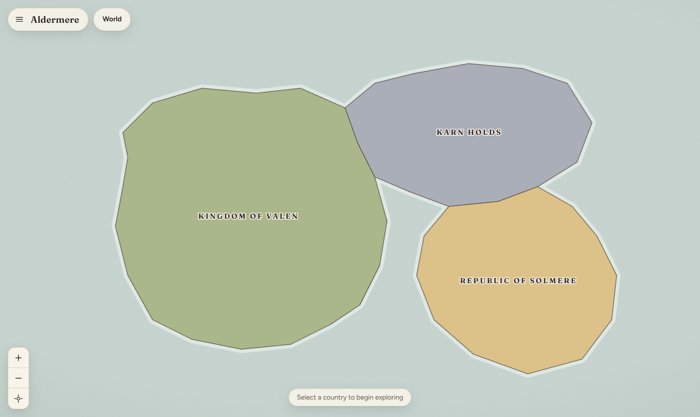
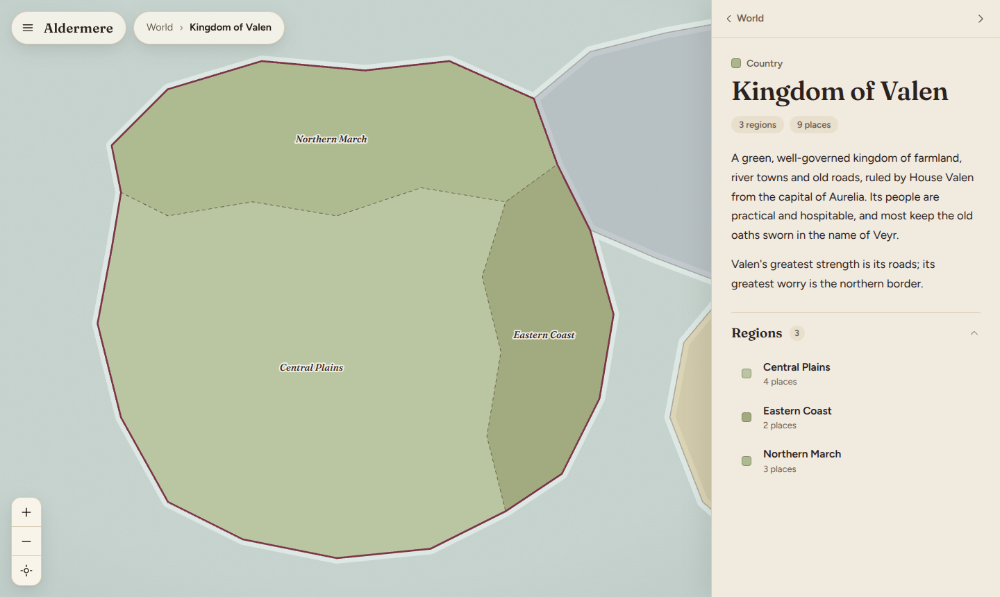
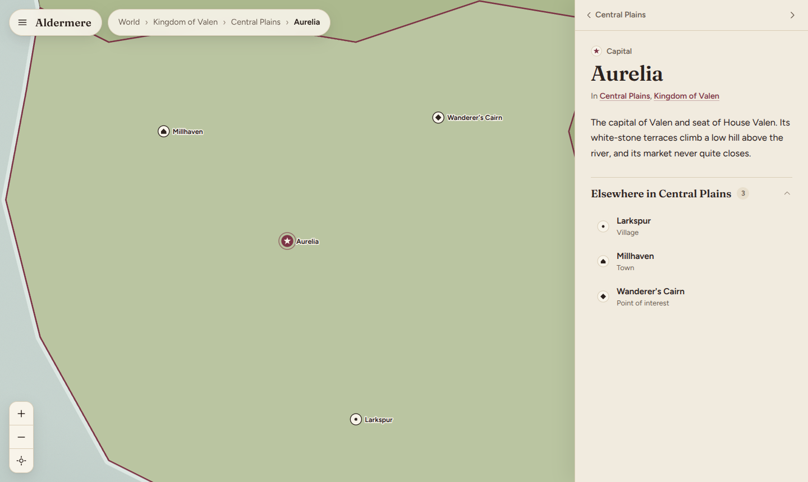
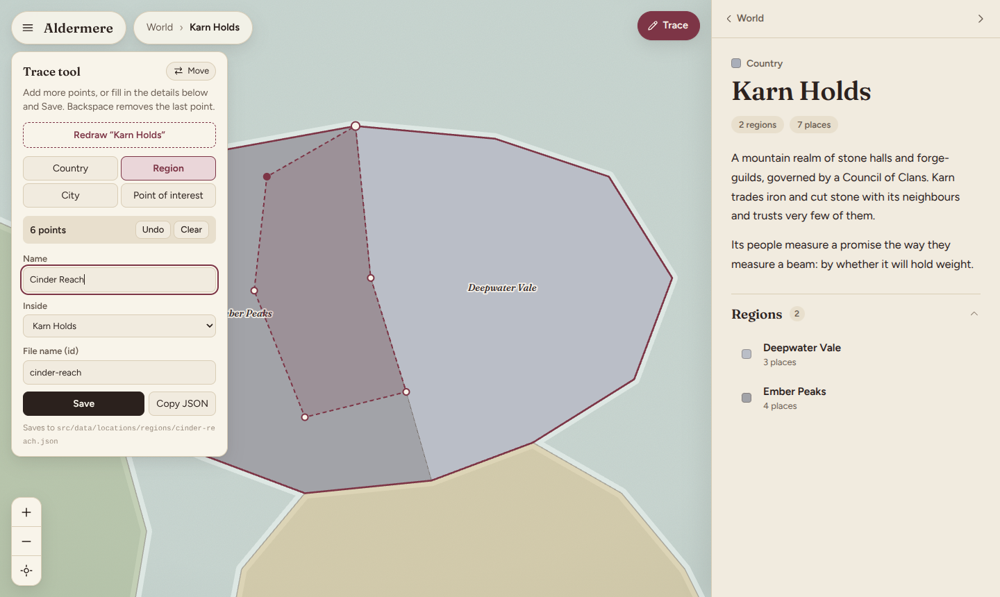

# Aldermere Atlas

A map-first interactive atlas and encyclopedia for a tabletop RPG world. Open the site, see the world, click a
country and the map glides in, click a region and it glides in again, then click a city to read about it.

The map is the *interface* to the world, not the whole of it: every place has a shareable URL, and the written lore
lives in plain files you edit by hand. **Adding a country, region or city never requires changing application code.**

| World | Country | City |
| :---: | :---: | :---: |
|  |  |  |

> **Status: Phase 1 (working atlas) is complete, plus a click-to-trace map builder.** The content system,
> encyclopedia sections and search are planned next. See [Roadmap](#roadmap) and [docs/ARCHITECTURE.md](docs/ARCHITECTURE.md).

---

## Contents

- [Getting started](#getting-started)
- [How the data is organised](#how-the-data-is-organised)
- [Adding a country](#adding-a-country)
- [Adding a region](#adding-a-region)
- [Adding a city or point of interest](#adding-a-city-or-point-of-interest)
- [Map coordinates](#map-coordinates)
- [Making and editing your map](#making-and-editing-your-map)
- [Location icons](#location-icons)
- [Replacing the demo world with yours](#replacing-the-demo-world-with-yours)
- [URLs](#urls)
- [Deploying to GitHub Pages](#deploying-to-github-pages)
- [Troubleshooting](#troubleshooting)
- [Project structure](#project-structure)
- [Roadmap](#roadmap)

---

## Getting started

You need [Node.js](https://nodejs.org) **20.19 or newer** (22 recommended).

```bash
npm install        # install dependencies (once)
npm run dev        # start the dev server, then open the printed address (http://localhost:5173)
```

Edits to files in `src/data/` show up in the browser as soon as you save.

**Want to build your own map?** Read [docs/TRACING.md](docs/TRACING.md). It's a step-by-step guide to turning a Paint
image into a clickable world.

| Command | What it does |
| --- | --- |
| `npm run dev` | Development server with instant reload |
| `npm run build` | Type-checks, then builds the production site into `dist/` |
| `npm run preview` | Serves the built `dist/` locally, to check what you'd deploy |
| `npm test` | Runs the unit tests (including a check that your world data is valid) |
| `npm run typecheck` | TypeScript check only |

### Using the map

- **Click** a country, then a region, then a city marker. The camera flies there and the side panel updates.
- **Scroll** to zoom (anchored to the cursor), **drag** to pan, or use the **+ / − / recenter** buttons.
- **Breadcrumbs** at the top jump back up. **Esc** steps up one level. The panel's **‹ back** button does the same.
- Hover anything for a tooltip. Click the **›** in the panel header to hide the panel; click the tab to bring it back.
- Everything in the side panel is clickable: regions, cities, and the "In *Central Plains*, *Kingdom of Valen*" links.

---

## How the data is organised

Everything geographic lives in `src/data/`:

```
src/data/
├── world.json                     ← world name, and the size of the map's coordinate space
└── locations/
    ├── countries/                 ← one .json file per location
    ├── regions/
    ├── cities/
    └── points-of-interest/
```

**Every `.json` file anywhere under `locations/` is picked up automatically.** The folder names are only for your own
tidiness: what a file *is* comes from its `"type"` field, so you can reorganise folders however you like.

The hierarchy is **World → Country → Region → City / Point of interest**, expressed by each file's `"parent"`:

| `type` | Drawn as | `parent` must be a… |
| --- | --- | --- |
| `country` | polygon | *(none, leave it out)* |
| `region` | polygon | `country` |
| `city` | marker | `region` (or `country`) |
| `poi` (point of interest) | marker | `region`, `country`, or `city` |

`id` values must be **unique across the whole world**, and use only lowercase letters, digits and hyphens
(`northern-march`). The id is what appears in URLs and what other files use to refer to this place.

Lists in the side panel are sorted alphabetically by name. If something is wrong, the app tells you which file and what to fix. See [Troubleshooting](#troubleshooting).

---

## Adding a country

1. Create `src/data/locations/countries/my-country.json`:

   ```json
   {
     "id": "my-country",
     "name": "My Country",
     "type": "country",
     "color": "#a9b78a",
     "summary": "One or two paragraphs shown in the side panel.\n\nA blank line starts a new paragraph.",
     "polygon": [
       [100, 100],
       [300, 80],
       [350, 200],
       [250, 300],
       [120, 250]
     ]
   }
   ```

2. Save. It appears on the world map straight away.

| Field | Required | Notes |
| --- | :---: | --- |
| `id` | yes | Unique slug, used in URLs |
| `name` | yes | Shown on the map and in the panel |
| `type` | yes | `"country"` |
| `polygon` | yes | At least 3 `[x, y]` points. See [Map coordinates](#map-coordinates) |
| `summary` | no | Plain text for the panel. `\n\n` separates paragraphs |
| `color` | no | Any CSS colour. If omitted, a colour from the built-in earthy palette is chosen |
| `labelPosition` | no | `{ "x": 200, "y": 180 }`. Override where the name is drawn (see [Troubleshooting](#troubleshooting)) |

## Adding a region

1. Create `src/data/locations/regions/my-region.json`:

   ```json
   {
     "id": "my-region",
     "name": "My Region",
     "type": "region",
     "parent": "my-country",
     "summary": "What this region is like.",
     "polygon": [
       [100, 100],
       [300, 80],
       [320, 180],
       [110, 190]
     ]
   }
   ```

2. `"parent"` is the `id` of the country it belongs to.
3. Draw the polygon **inside the country's outline**. For a tidy map, make neighbouring regions **share the same
   corner points** along their common border, and reuse the country's outer points along the coast.

Regions appear when their country is selected. If `color` is omitted, the region gets a lighter or darker shade of its
country's colour so neighbours stay distinguishable.

## Adding a city or point of interest

1. Create `src/data/locations/cities/my-city.json`:

   ```json
   {
     "id": "my-city",
     "name": "My City",
     "type": "city",
     "parent": "my-region",
     "icon": "capital",
     "coordinates": { "x": 420, "y": 310 },
     "summary": "What it's like to live there."
   }
   ```

2. `"parent"` is the `id` of its region. `coordinates` is a single point, not a polygon.
3. Use `"type": "poi"` for things that aren't settlements (a ruin, a battlefield, a temple). Points of interest can
   also sit *inside a city* (`"parent": "my-city"`), and then appear in that city's panel under "Places of note".

| Field | Required | Notes |
| --- | :---: | --- |
| `id`, `name`, `type`, `parent` | yes | `type` is `"city"` or `"poi"` |
| `coordinates` | yes | `{ "x": …, "y": … }` |
| `icon` | no | One of the [icons below](#location-icons). Defaults to `city` for cities and `other` for points of interest |
| `summary` | no | Plain text for the panel |

Markers appear when their region is selected (or when you select the marker itself).

---

## Map coordinates

All geometry (country polygons, region polygons, city coordinates) lives in **one shared coordinate space**, defined by
`map` in `src/data/world.json`:

```json
"map": { "width": 1200, "height": 760 }
```

```
(0,0) ────────────────────────► x   increases to the right
  │      ┌────────┐
  │      │ (420,310) ← a city
  │      └────────┘
  ▼
  y   increases DOWNWARDS  (the usual screen convention, not maths class)
                                        (1200, 760)
```

- The origin `(0, 0)` is the **top-left** corner. **y grows downward.**
- Units are arbitrary. Think of them as pixels of an imaginary image `width` × `height`.
- Only the *ratio* `width : height` matters for the shape of the map. The app scales it to fit the screen.
- Because everything shares one space, a region's points line up with its country's points automatically. Zooming
  is just changing which part of the space is shown.
- **Point order in a polygon doesn't matter** (clockwise or anticlockwise both work), and you don't need to repeat the
  first point at the end. The shape is closed for you.

**Finding coordinates:** you rarely need to. The [Trace tool](#making-and-editing-your-map) records them for you. If you
do want a number, while `npm run dev` is running the bottom-right of the map shows the coordinates under your cursor,
and **Shift-click** copies `[x, y]` to your clipboard. (Both are development-only and not in the production build.)

## Making and editing your map

**Full walkthrough: [docs/TRACING.md](docs/TRACING.md).** It starts from a map drawn in Paint and ends with a
clickable world, with no coding.

The short version: while `npm run dev` is running, a **Trace** button appears at the top right of the map. Choose what
you're drawing (country, region, city…), **click around its edge** on the map, type a name, and press **Save**. The
file is written for you and the shape appears. Corners of shapes already on the map are snapped to, so neighbouring
borders match exactly. If you have a reference image (your Paint map) faded behind the map, you can trace straight
over it.



To change something afterwards, select it on the map, open **Trace** and press **Redraw**. Its summary and other
settings are kept. To nudge a single corner, edit its numbers in the file. (Dragging individual corners is planned for
Phase 4.)

You can also skip the tool entirely and write the files by hand using the templates above. It writes the same files.

## Location icons

Set `"icon"` on a city or point of interest:

| `icon` | Looks like | Suggested for |
| --- | --- | --- |
| `capital` | star (drawn in the accent colour) | Capitals |
| `city` | skyline | Large cities |
| `town` | house | Towns |
| `village` | small dot | Villages, hamlets |
| `castle` | crenellated wall | Castles, fortresses |
| `temple` | columned temple | Temples, shrines |
| `ruin` | broken columns | Ruins |
| `battlefield` | crossed swords | Battlefields |
| `dungeon` | keyhole | Dungeons, caves |
| `other` | diamond | Anything else |

Icons are data-driven. To add a new one, add its name to `LOCATION_ICONS` in `src/types/world.ts` and a glyph in
`src/components/map/locationIcons.tsx` (each is a few lines of SVG).

---

## Replacing the demo world with yours

1. **Rename your world.** Edit `src/data/world.json`: change `id`, `name`, `tagline`, `summary`. If you're tracing a
   map, also set `map.width`/`height` and the reference image (see [docs/TRACING.md](docs/TRACING.md)).
2. **Clear out the demo places.** Delete everything inside `src/data/locations/` (the files, not the folders).
   While there are no countries the app shows an empty map, which is expected.
3. **Add your countries first**, then regions, then cities: each one needs its parent to exist. Use the
   [Trace tool](docs/TRACING.md) (easiest) or the file templates above, and check the browser after each one.
4. **Delete `src/lib/content/demoWorld.test.ts`.** It asserts facts about the demo world specifically (three
   countries, Aurelia's URL…) and would fail on yours. Then run `npm test`: the remaining `worldData.test.ts` checks
   that your data is valid and that every place has a working URL.
5. **Commit.** Your world is now just files in Git, with a history of every change.

Tip: work top-down, checking the browser after each country. It's much easier to fix one polygon than twenty.

---

## URLs

Every place has a direct link, and the browser's back button works:

```
/atlas                                                     the world map
/atlas/kingdom-of-valen                                    a country
/atlas/kingdom-of-valen/central-plains                     a region
/atlas/kingdom-of-valen/central-plains/aurelia             a city
```

Because ids are unique, **short links work too**: `/atlas/aurelia` redirects to the full path above.

## Deploying to GitHub Pages

The repository includes `.github/workflows/deploy.yml`. To use it: push to GitHub, then in the repository go to
**Settings → Pages → Source: GitHub Actions**. Every push to `main` runs the tests, builds the site with the right
sub-path, and publishes it.

To deploy by hand, build with your repository name as the base path:

```bash
VITE_BASE=/my-repo-name/ npm run build     # Windows PowerShell: $env:VITE_BASE="/my-repo-name/"; npm run build
```

The build also writes `dist/404.html` (a copy of the app), which lets GitHub Pages serve direct links like
`/atlas/kingdom-of-valen` even though it has no server-side routing.

---

## Troubleshooting

**The page says "Your world data needs a fix."**
That's the validator. Each message names the file and the problem, for example *"has parent 'centrl-plains', but no
location with that id exists."* Fix the file and save: the page reloads itself. The most common causes are a typo in
`parent`, an `id` that isn't lowercase-with-hyphens, and a trailing comma in the JSON.

**A red Vite error overlay mentions "JSON" or "Unexpected token".**
The file isn't valid JSON: usually a missing comma between fields, a trailing comma after the last field, or single quotes
instead of double quotes. Paste the file into a JSON validator, or open it in VS Code, which underlines the mistake.

**A yellow "data warnings" note appears in the corner (dev only).**
The data loads but something looks off, most often a city whose coordinates fall outside its region's polygon, or
points beyond the map's `width`/`height`. The message gives the location.

**My region doesn't show up.**
Regions only appear once their *country* is selected. Check `"type": "region"` and that `"parent"` is the country's id.
Also check the polygon's coordinates are inside `0…width` and `0…height`.

**My city doesn't show up.**
Markers appear once their *region* is selected. Check `"parent"` is the region's id, and that `coordinates` uses
`{ "x": …, "y": … }`, not `[x, y]` (polygons use arrays, markers use objects).

**A label is in an awkward place, or overlaps a marker.**
Labels default to the middle of the shape. For an oddly-shaped region, add
`"labelPosition": { "x": 300, "y": 220 }` to its file.

**I can't see the Trace button.**
It only exists while `npm run dev` is running, not in a built or published site. See [docs/TRACING.md](docs/TRACING.md).

**A polygon looks twisted or has a "bow-tie".**
Its points cross over each other. Points should go around the edge in order, rather than jumping across the shape.

**My traced outlines don't line up with my reference image.**
`map.width` and `map.height` in `world.json` must equal the image's pixel size exactly.

**The reference image doesn't appear.**
`referenceImage.src` is relative to `public/`, so `"reference/my-map.png"` means the file
`public/reference/my-map.png`. No leading slash, and check the spelling and case. Restart `npm run dev` if you just
added the file.

**Deep links 404 on GitHub Pages, or styles/scripts fail to load.**
The site is served from a sub-path. Build with `VITE_BASE=/your-repo-name/` (the included workflow does this
for you).

**`npm install` or `npm run dev` fails.**
Check `node -v` is 20.19 or newer. If the port is busy, Vite picks the next free one and prints it.

**Colours look flat or wrong in an older browser.**
The region shading uses CSS `color-mix()`, supported by browsers from 2023 onward. Update your browser, or give the
regions an explicit `"color"`.

---

## Project structure

```
src/
├── data/                  ← YOUR WORLD: JSON files. No code.
│   ├── world.json
│   └── locations/**.json
├── types/world.ts         ← the data model (TypeScript types)
├── lib/                   ← plain logic: no React, easy to unit-test
│   ├── content/           validate JSON → build the lookup index
│   ├── map/               geometry, camera maths, level-of-detail rules, colours
│   ├── routing/           location ⇄ URL
│   └── navigation/        the hamburger menu's section list
├── hooks/useMapViewport.ts   the zoom/pan camera
├── context/               shares the loaded world with components
├── components/
│   ├── map/               the SVG map: shapes, markers, labels, tooltip, controls
│   ├── sidebar/           the information panel
│   ├── navigation/        header, breadcrumbs, menu
│   └── common/            small shared pieces
├── pages/                 route-level screens
└── styles/                design tokens and global CSS

tools/atlasDevSave.ts      dev-only: lets the Trace tool save files (never part of a build)
docs/                      TRACING.md (making your map), ARCHITECTURE.md
```

The full rationale is in [docs/ARCHITECTURE.md](docs/ARCHITECTURE.md).

---

## Roadmap

| Phase | Scope | Status |
| --- | --- | --- |
| 1 | Working atlas: map, zoom/pan, side panel, breadcrumbs, country → region → city, markers, icons, tooltips, routing, validation, demo world | **Done** |
| 2 | Content system: Markdown lore per entity, cross-references between entities, global search | Next |
| 3 | Encyclopedia: People, Factions, Organizations, Pantheon, Politics, Culture, History timeline | Planned |
| 4 | In-browser map editor | **Partly done:** click-to-trace, snapping, save and redraw (dev only). Still to come: dragging individual corners, deleting from the UI |
| 5 | Polish: animation, typography, empty/loading states, responsive and accessibility passes | Planned |

Documentation for writing Markdown lore, people, factions, deities, historical events and cross-references arrives
with the phases that build them. Until then, a place's text is its JSON `"summary"`. The hamburger menu already shows
the planned sections, greyed out as "Soon".
